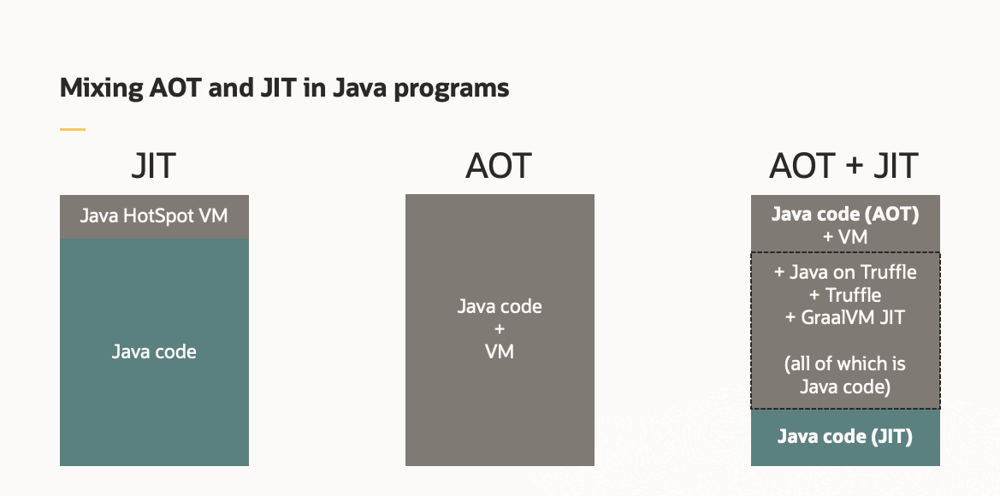

It's good to have orchestrators managing containers so applications can scale and heal. But one reason for them is also related to startup time: how fast can an orchestrator instantiate a container and start a new instance of a Java application? The answer is usually that the JVM will always take a long time to startup, no matter how fast the orchestrator works. GraalVM is a technology that can shorten this startup time by building native images out of Java code. 

It is  an extension of the JVM and based on HotSpot/OpenJDK, it has a polyglot feature, to transparently mix and match supported languages.

> JVM
>
> By definition, the JVM is a software machine that simulates what a real machine does. It has an instruction set, a virtual computer architecture, and an execution model. It can run code written with this virtual instruction set, pretty much like a real machine can run machine code.
>
> HotSpot
>
> HotSpot is an implementation of the JVM concept. It was originally developed by Sun, and now it is owned by Oracle. There are other implementations of the JVM specification, like JRockit, IBM J9, among many others.
>
> OpenJDK 
>
> OpenJDK is a project under which an open source implementation of HotSpot (and many other pieces of the JDK e.g. compiler, APIs, tools, etc) is developed.

It also includes a new high performance Java compiler, itself called Graal.

Running applications inside a JVM comes with startup and footprint costs. GraalVM has a feature to create native images for existing JVM-based applications. 

> What is this native images? It is an executable that includes the application classes, classes from its dependencies, runtime library classes, and statically linked native code from JDK.

The image generation process employs static analysis to find any code reachable from the main Java method and then performs full Ahead-OfTime (AOT) compilation on the Substrate VM.

> The JVM executes Java bytecode and compiles frequently executed code to native code. This is called Just-in-Time (JIT) Compilation. The JVM decides which code to JIT compile based on profiling information at runtime.
>
> AOT aims to improve this so-called warming-up period, the build time and not the runtime.
>
> > AOT compilation need to use the same JDK for compilation and execution.
>
> HotSpot's execution engine has a JIT compiler. It starts interpreting the code, the methods are compiled at the client compilation level and then finally move to the server compilation level. Even with the improvements in the compilation levels, HotSpot still starts interpreting its bytecode and then moves on to JIT-ing it.

The resulting native executable contains the program in machine code for an immediate execution. This helps avoid running the classes in the interpreted mode or at a suboptimised compilation level and improves the performance of Java to match the performance of native languages for fast startup and low memory footprint.

The major differentiators of GraalVM compared to the base JDK are:

- Sulong: for C/C++ and other LLVM-based languages (e.g. Fortran).
- Truffle: creating instrumentations for GraalVM (R, Ruby, Python, NodeJS, etc.). 
- Graal Compiler: Written in Java and supports both dynamic and static compilation.
- JVM Compiler Interface: allows to plug-in additional Java compilers to the JVM.
- Java HotSpot VM: Runtime with the GraalVM compiler enabled as the top tier JIT compiler for JVM-based languages.
- Substrate VM: Allows AOT compilation for applications written in various languages.

```
                                                  C, C++
                                           +-------------+
              R, Node, JS, Python, Ruby..  |    Sulong   |
              +----------------------------+-------------+
Java, Scala.. |       Truffle                            |
+--------------------------------------------------------+
|                   Graal Compiler                       |
+------------------------+-------------------------------+
| JVM Compiler Interface | +-----------------------------+
+------------------------+ |                             |
|     Java HotSpot VM    | |    Substrate VM             |
+------------------------+ +-----------------------------+
```

GraalVM allows you to ahead-of-time compile Java code to a standalone executable, called a native image

It does not run on the Java VM and includes the necessary components to manage memory and thread scheduling from a VM called Substrate VM.

> Substrate VM is the name for the runtime components. It can take a regular Java application and compile it into native binary. 

Graal history dates back to works on MaxineVM in 2013. Oracle invested in this research project based on Java and then released it under the name of GraalVM. GraalVM has become an important part of the Quarkus story, and Red Hat is committed to its success after May 2019.

In June 2020 Red Hat announced the project Mandrel, a regular OpenJDK with a specially-packaged GraalVM native image. With Mandrel, Red Hat wants to speed the efficiency of the Quarkus framework, especially on the native-image feature.

In January 2021, GraalVM 21.0 introduced a new installable component, named espresso, which provides a JVM implementation written in Java.

> Espresso or Java on Truffle is Java on Java VM! 

```
               Java, Scala..                      C, C++
              +---------------+            +-------------+
              |Java On Truffle| R, Node..  |    Sulong   |
              +---------------+------------+-------------+
Java, Scala.. |       Truffle                            |
+--------------------------------------------------------+
|                   Graal Compiler                       |
+------------------------+-------------------------------+
| JVM Compiler Interface | +-----------------------------+
+------------------------+ |                             |
|     Java HotSpot VM    | |    Substrate VM             |
+------------------------+ +-----------------------------+
```

Espresso makes it possible to run Java code via the Truffle framework elevating Java to the level of the other languages supported on GraalVM.

> Being implemented in Java and being able to run Java gives Java on Truffle a very interesting property: it can run itself. Indeed, Java on Truffle is a metacircular VM, it can run itself several levels deep (albeit slower and slower every time).

## Embedding 11 in 8

Java on Truffle is an actual JVM, and it’s also a Java program, which means you can run it within another Java program. This opens very interesting avenues for compartmentalization of different components in your applications. For example, if you point Java on Truffle to a JDK11 distribution it can run Java 11. With access to Java 8, it becomes Java 8. When you have both distributions available, you can run Java on Truffle in the context of a Java 8 app and use it to run Java 11 byte code, and vice versa. If there’s a library that is only available for Java 8, you can migrate to a newer base JDK and still run that particular library, with some programmatic efforts to establish the interoperability, in the compatible JDK 8 within the same Java process.



## Mixing AOT and JIT

Since Java on Truffle, Truffle, the GraalVM compiler and all other necessary components to run Java on Truffle efficiently are all written in Java, it is possible to build a native image executable with the infrastructure to run Java on Truffle.
This means that you can take a Java app, build a JVM into it, and then run that app either on a JVM or as a native image. Note that in the latter case, Java on Truffle can actually execute arbitrary Java code which doesn’t necessarily need to be known at the build time.
That’s right, Java on Truffle can bring the JIT compiler and the dynamic Java runtime to an ahead-of-time compiled binary.